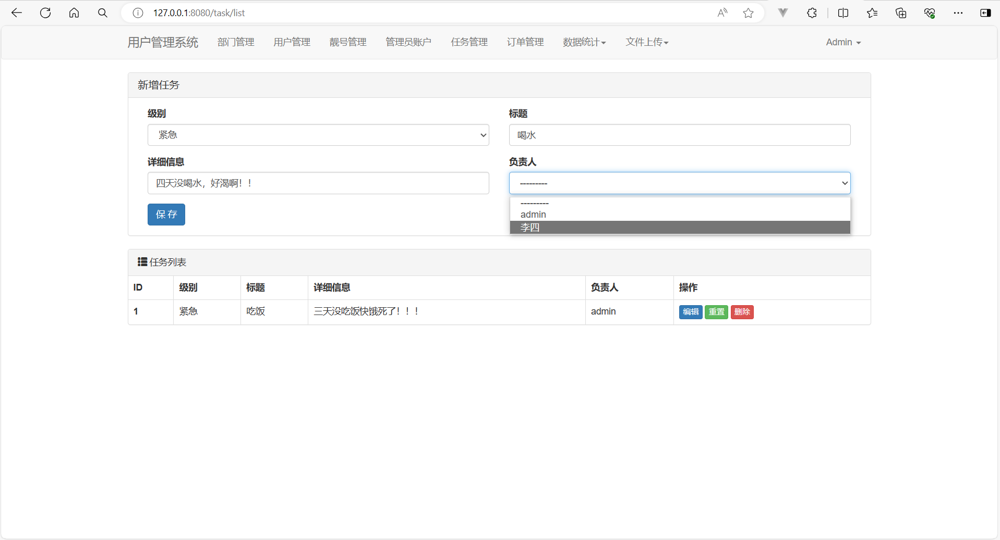
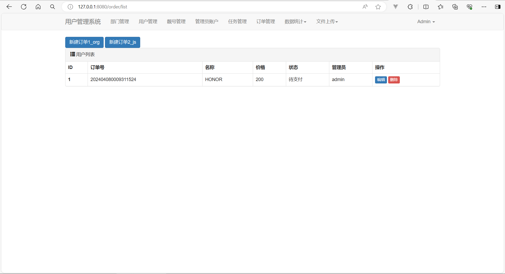
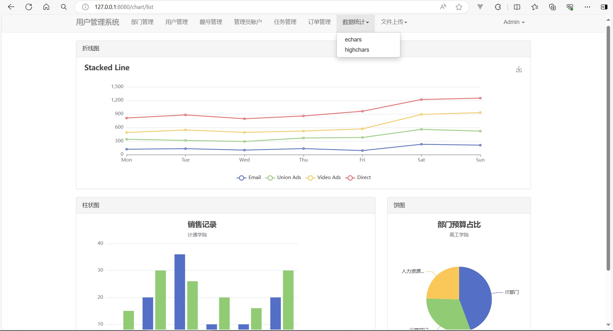

# 后台管理系统（基于Django实现）

# 1. 项目说明

​	本应用是基于Django实现的后台管理系统，UI组件使用BootStrap，通过Mysql数据库进行数据存储，图表有用到echarts和hcharts。

# 2. 使用说明

- 首先安装所需依赖库：django，PIL等库。
- 然后再修改setting中的mysql数据库配置连接到一个新的用于存放账号信息的一个数据库上。

- 最后按照正常的Django项目启动流程即可正常运行：
  - `python manage.py makemigrations`
  - `python manage.py migrate`
  - `python manage.py migrate`（第二次执行效果为向绑定的数据库插入管理员账号：用户名Admin、密码123）
  - `python manage.py runserver 8080`

# 3. 效果展示

**登陆界面**

**部门管理**

**新增用户**

**用户管理界面**

**管理员界面**

**任务管理**

**订单管理**

**任务管理**

**头像信息上传**

